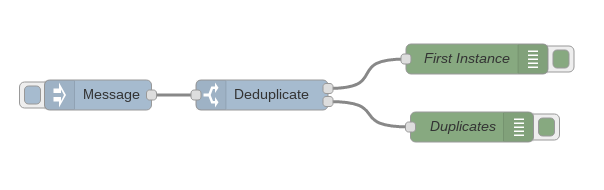

node-red-contrib-deduplicate
============================

Node-RED node that removes duplicate messages.

Added Key Property to specify the property in the payload to compare for de-duplication. Payload is the default key property.

